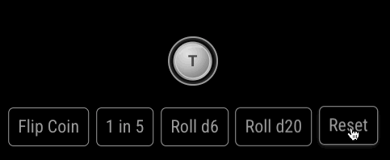
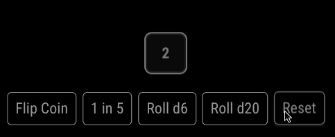
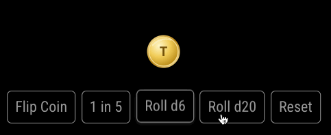
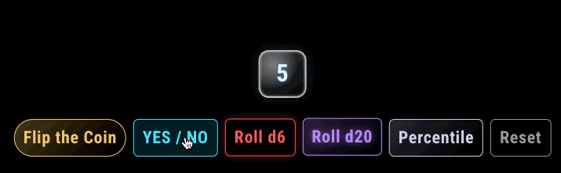

# MMM-Chance

Simple coin flip and dice roll module for MagicMirror².

https://magicmirror.builders/

https://github.com/MagicMirrorOrg/MagicMirror

## Demo

Note that due to the frame rate capture of the gifs, the animations don't look as jumpy and the dice roll doesn't look as slow in the real module, but all of the timings are configurable!






## Features

- Clean UI with coin and die animations
- Works with touch or notifications (for non-touch setups)
- Configurable buttons (coin or dice)
- Optional flat gray coin style to match the die

## Installation

1. Copy this module into your MagicMirror modules folder.
   - Navigate into your MagicMirror² `modules` folder and execute

     `git clone https://github.com/ryan-d-williams/MMM-Chance.git`.
2. Add it to your `config/config.js`.

## Configuration

### Example

```js
{
  module: "MMM-Chance",
  position: "bottom_center",
  config: {
    animationDurationMs: 1200,
    animationFrameMs: 90,
    autoResetMs: null,
    compact: false,
    flatCoin: true,
    notification: "CHANCE_ACTION",
    buttons: [
      { id: "coin", label: "Flip Coin", mode: "coin", notify: "coin", className: "btn-coin" },
      { id: "d5", label: "1 in 5", mode: "dice", sides: 5, notify: "d5" },
      { id: "d6", label: "Roll d6", mode: "dice", sides: 6, notify: "d6" },
      { id: "d20", label: "Roll d20", mode: "dice", sides: 20, notify: "d20" }
    ]
  }
}
```

### Options

Option | Type | Default | Description
--- | --- | --- | ---
`animationDurationMs` | number | `1200` | Total roll/flip duration in milliseconds.
`animationFrameMs` | number | `90` | How often to update the die face during rolling.
`autoResetMs` | number \| null | `null` | If set, automatically resets to buttons after this many milliseconds.
`compact` | boolean | `false` | If `true`, use a compact layout for smaller screens.
`flatCoin` | boolean | `true` | If `true`, the coin uses a flat gray style like the die.
`notification` | string \| null | `null` | If set, module listens for this notification to trigger actions.
`buttons` | array | [Coin, d6, d10, d100] | Button definitions (see below).

### Button definitions

Property | Type | Required | Description
--- | --- | --- | ---
`id` | string | no | Unique internal id. If omitted, one is generated.
`label` | string | no | Button label text.
`mode` | `"coin"` \| `"dice"` | yes | Flip a coin or roll a die.
`sides` | number | dice only | Number of sides for dice buttons (2-10000).
`notify` | string | no | Optional name used for notification-triggered actions.
`className` | string | no | Optional extra CSS class for styling this button.

## Notifications (Non‑Touch Control)

For non-touch Magic Mirrors, you can send notifications to trigger the coin flips or dice rolls.

To enable notifications for MMM-Chance:

1. Set `notification` in the module config.
2. Give each button a `notify` value.
3. Send a notification with a payload that matches the `notify` value.

### Notification payloads

You can send:

- A string (e.g. `"d6"`)
- An object with one of these keys: `name`, `button`, `action`, `id`

### Examples

From another module:

```js
this.sendNotification("CHANCE_ACTION", "d6");
```

```js
this.sendNotification("CHANCE_ACTION", { name: "coin" });
```

Reset the stage:

```js
this.sendNotification("CHANCE_ACTION", "reset");
```

## Styling Notes

- The stage appears above the buttons and is centered.
- The buttons remain stationary.

## Example Custom Styling (Overrides)

Add overrides in `css/custom.css`

### Buttons

```css
.MMM-Chance .buttonRow {
  gap: 12px;
}

.MMM-Chance .btn {
  padding: 10px 16px;
  border-radius: 999px;
  border-width: 2px;
  background: linear-gradient(135deg, rgba(255, 255, 255, 0.12), rgba(255, 255, 255, 0));
  letter-spacing: 0.04em;
  text-transform: uppercase;
  font-weight: 600;
}

.MMM-Chance .btn:hover {
  box-shadow: 0 6px 16px rgba(0, 0, 0, 0.25);
}

.MMM-Chance .btn.btn-coin {
  border-color: #f5d07a;
  color: #f5d07a;
}

/* Target a specific button by id */
.MMM-Chance .btn[data-action-id="d6"] {
  background: rgba(255, 255, 255, 0.12);
  border-color: rgba(255, 255, 255, 0.4);
}
```

### Coin

```css
.MMM-Chance .tokenWrap {
  width: 80px;
  height: 80px;
}

.MMM-Chance .coin {
  width: 64px;
  height: 64px;
  border-radius: 50%;
  background: radial-gradient(circle at 30% 30%, #fff4c1, #d3a348 70%, #9f6b1f);
  box-shadow: inset 0 0 0 2px rgba(255, 255, 255, 0.4), 0 10px 18px rgba(0, 0, 0, 0.35);
}

.MMM-Chance .tokenSvg {
  filter: drop-shadow(0 2px 2px rgba(0, 0, 0, 0.35));
}
```

### Dice

```css
.MMM-Chance .dieFace {
  width: 64px;
  height: 64px;
  border-radius: 14px;
  border-color: rgba(255, 255, 255, 0.9);
  background: linear-gradient(160deg, rgba(255, 255, 255, 0.2), rgba(255, 255, 255, 0.04));
  box-shadow: inset 0 0 0 2px rgba(255, 255, 255, 0.2), 0 10px 18px rgba(0, 0, 0, 0.35);
}

.MMM-Chance .dieValue {
  font-size: 26px;
  font-weight: 800;
}
```

## Troubleshooting

- If nothing happens on notification, confirm the `notification` string matches exactly and the payload matches a `notify` value.
- If the die looks too fast/slow, tweak `animationFrameMs`.

## Bugs & Feature Requests

If you find an issue or want a new feature, [add it as an issue](https://github.com/ryan-d-williams/MMM-Chance/issues) and I'll be happy to (try to) make it happen
